# SOC Automation and Detection Engineering Homelab

This repository documents an end-to-end SOC engineering homelab built to simulate enterprise-style monitoring, alert triage, enrichment, case management, forensic collection, and automated containment.

## Overview

The lab is organized into three operational planes:

- Data plane: `pfSense`, `Squid Proxy`, and `Suricata` enforce controlled egress, SSL inspection, and network detection coverage.
- Telemetry plane: `Sysmon`, `Wazuh`, remote syslog, and `Splunk Universal Forwarder` push endpoint and network evidence into `Splunk`.
- Response plane: `n8n` orchestrates `VirusTotal`, a local LLM triage step, `DFIR-IRIS`, `Velociraptor`, and `Wazuh Active Response`.

## Objectives

- Build a realistic SOC homelab with segmented traffic inspection and centralized telemetry.
- Validate Splunk-driven detections with synthetic high-risk and low-risk events.
- Automate analyst workflows for enrichment, ticketing, triage, forensics, and containment.
- Preserve evidence with screenshots that are ready for GitHub and GitHub Pages publication.

## Lab Stack

| Layer | Components | Purpose |
| --- | --- | --- |
| Perimeter and inspection | `pfSense`, `Squid Proxy`, `Suricata` | Force proxy-based egress, decrypt inspected traffic, and monitor network activity. |
| Endpoint telemetry | `Windows 11`, `Sysmon`, `Wazuh Agent`, `Splunk UF` | Generate host telemetry and forward it into the SIEM pipeline. |
| Analytics and correlation | `Splunk` | Centralize logs, run searches, and trigger SOAR workflows. |
| SOAR and case handling | `n8n`, `DFIR-IRIS` | Normalize alerts, enrich evidence, and track investigations. |
| Forensics and containment | `Velociraptor`, `Wazuh Active Response` | Collect volatile evidence and isolate affected endpoints. |
| Intelligence and reasoning | `VirusTotal`, local LLM via `LM Studio` or `Ollama` | Enrich indicators and provide deterministic triage output. |

## Detection and Response Flow

1. Endpoint, proxy, firewall, and IDS telemetry is forwarded into `Splunk`.
2. A Splunk correlation search sends a webhook payload into `n8n`.
3. `n8n` creates or updates a case in `DFIR-IRIS`.
4. The workflow enriches the alert with `VirusTotal`.
5. A local LLM returns a deterministic `HIGH_RISK` or `LOW_RISK` triage decision.
6. High-risk alerts trigger `Velociraptor` collection and `Wazuh` host isolation.
7. Low-risk alerts are documented and closed with supporting context.

## Validation Approach

Two synthetic scenarios were used to validate the workflow safely:

- High-risk path: a simulated malicious IOC event designed to trigger escalation, enrichment, forensic collection, and containment.
- Low-risk path: a benign browser and gateway activity event designed to confirm safe closure behavior.

No real malware execution or uncontrolled external traffic was required for these tests.

## Evidence Walkthrough

### 1. Architecture and topology

**Ref 1.** Inter-VLAN telemetry flow and SOAR remediation pipeline control vectors.

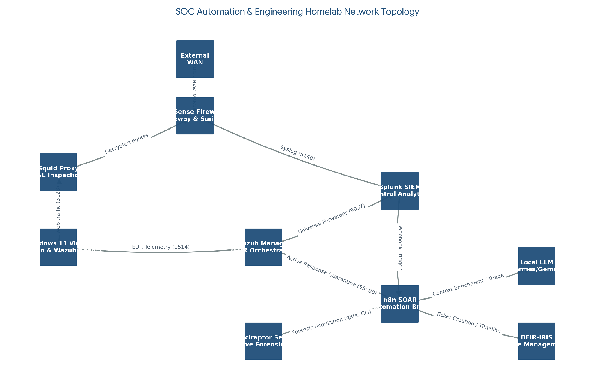

**Ref 2.** Consolidated homelab architecture connecting perimeter inspection, telemetry, SIEM, and response services.

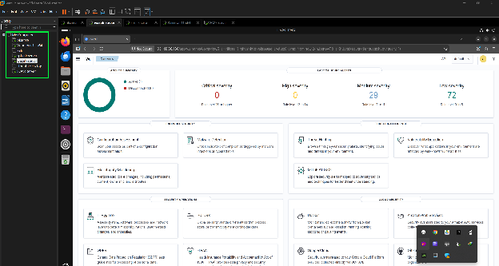

### 2. Perimeter and endpoint instrumentation

**Ref 3.** `pfSense` perimeter configuration supporting LAN control, proxy routing, and inspection.

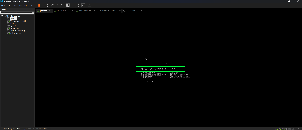

**Ref 4.** Windows 11 endpoint prepared with `Sysmon`, `Splunk Universal Forwarder`, and `Wazuh Agent`.

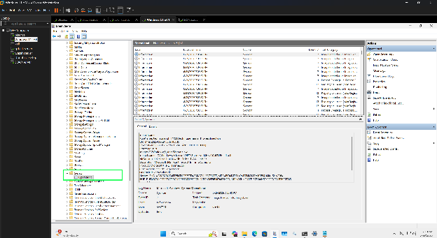

**Ref 5.** Additional endpoint evidence showing the installed monitoring stack used during workflow validation.

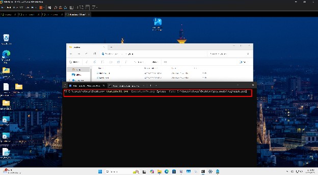

### 3. Splunk detection and correlation

**Ref 6.** Splunk evidence view used to validate the alerting and correlation stage before handing off to SOAR.

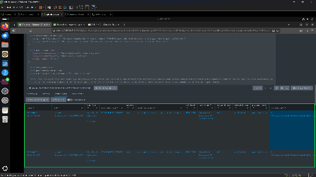

### 4. Wazuh telemetry and active response

**Ref 7.** Wazuh alert forwarding into the centralized workflow.

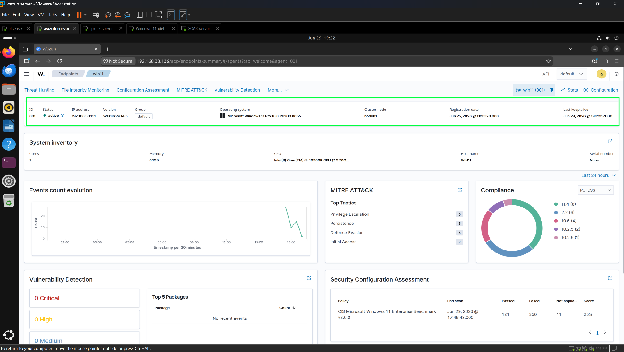

**Ref 8.** Wazuh active response enforcing host isolation through a firewall rule.

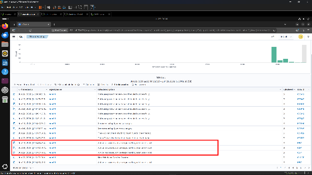

### 5. SOAR orchestration and case handling

**Ref 9.** `n8n` workflow receiving Splunk alerts and orchestrating the response chain.

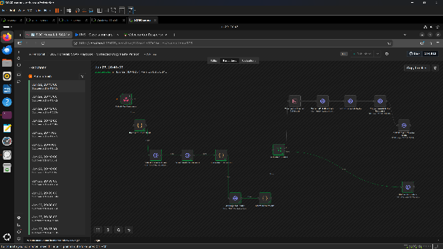

**Ref 10.** `n8n` branching logic for enrichment, triage, case updates, and automated follow-on actions.

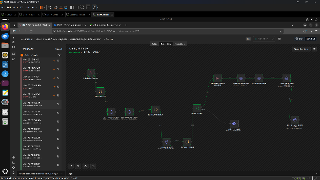

**Ref 11.** `DFIR-IRIS` investigation case created and updated for each alert.

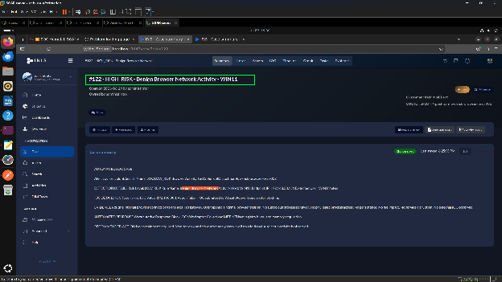

### 6. Forensic collection

**Ref 12.** `Velociraptor` forensic collection execution for the affected host.

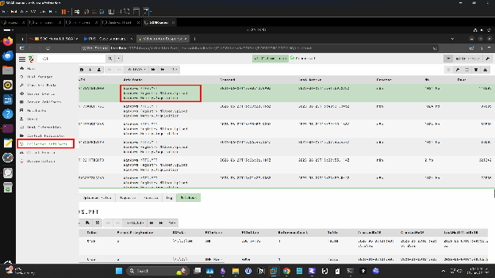

**Ref 13.** Master File Table artifact collection captured during the response workflow.

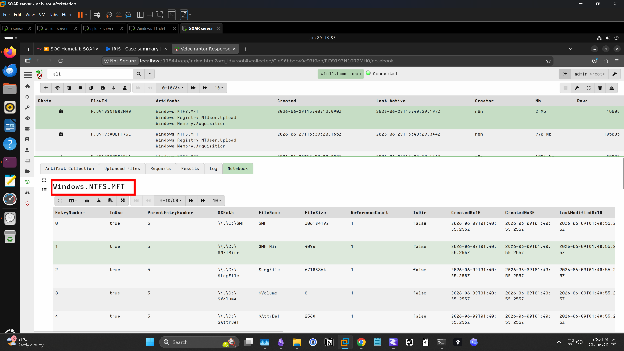

**Ref 14.** Windows Registry artifact collection preserved as part of automated triage.

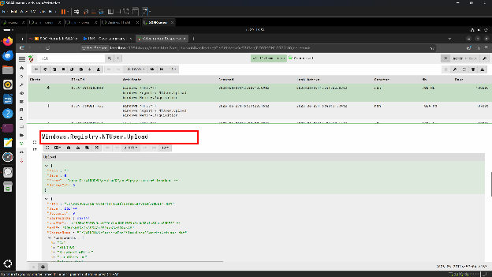

## Repository Structure

```text
.
|-- README.md
|-- CONTRIBUTING.md
|-- SECURITY.md
|-- .github/
|   |-- ISSUE_TEMPLATE/
|   `-- PULL_REQUEST_TEMPLATE.md
|-- assets/
`-- docs/
    |-- _config.yml
    |-- index.md
    `-- assets/
```

## GitHub Pages

This repository is prepared for GitHub Pages deployment from the `/docs` folder.

1. Push the repository to GitHub.
2. Open `Settings` > `Pages`.
3. Set the source to `Deploy from a branch`.
4. Select the `main` branch and the `/docs` folder.
5. Save the configuration.

The published site will use [`docs/index.md`](docs/index.md) and the mirrored screenshot set in [`docs/assets`](docs/assets).

## Notes

- This is a controlled homelab for defensive engineering and portfolio documentation.
- Any IPs, alerts, and containment actions shown here were used for lab validation.
- The write-up is intentionally evidence-heavy so it works well both on GitHub and on GitHub Pages.
